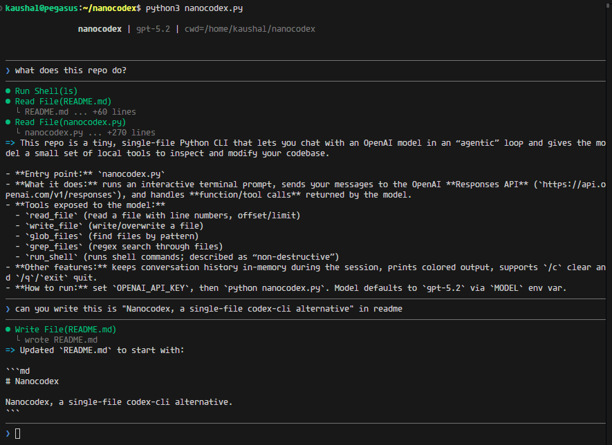

# Nanocodex

Nanocodex, a single-file codex-cli alternative.

Single Python file, zero dependencies, 266 lines.

Inspo. from nanocode.



## Features

- Full agentic loop with tool use
- Tools: `read`, `write`, `glob`, `grep`, `bash`
- Conversation history
- Colored terminal output

## Usage

```bash
export OPENAI_API_KEY="your-key"
python nanocodex.py
```

## Commands

- `/c` - Clear conversation
- `/q` or `exit` - Quit

## Tools

| Tool | Description |
|------|-------------|
| `read` | Read file with line numbers, offset/limit |
| `write` | Write content to file |
| `glob` | Find files by pattern, sorted by mtime |
| `grep` | Search files for regex |
| `bash` | Run shell command |

## Example

```
────────────────────────────────────────
❯ what files are here?
────────────────────────────────────────

⏺ Glob(**/*.py)
  └ nanocodex.py

⏺ There's one Python file: nanocodex.py
```

## License

MIT
